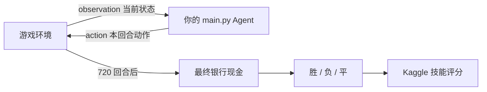
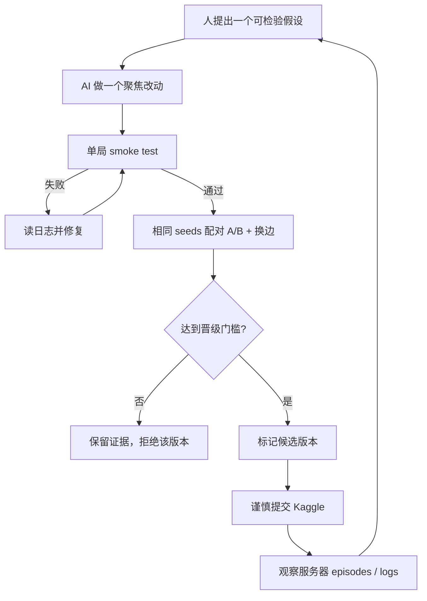
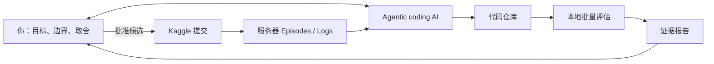

# Kaggriculture 初学者进阶与 Agent 开发手册

> 适用对象：第一次参加 Kaggle Simulation Competition、已经有一个可运行 V0 的开发者  
> 阅读日期：2026-09-02 上午（计划）  
> 目标：用 60 分钟建立完整心智模型，并知道未来 3 天到 1 周每一步做什么

## 先说结论

你已经完成了第一座里程碑：**可提交、可运行、可复现的 V0**。截图中的 `Pending` 表示 Kaggle 已收到文件、正在验证；它还不等于 `Successful`，也不等于已经有稳定排名。

这个比赛不是常见的“拿 `train.csv` 训练模型，再预测 `test.csv`”。它是一个双人农场经营模拟器：你的 `main.py` 每回合读取游戏状态，返回动作；一局默认 720 回合，最终银行现金更多的一方赢。Kaggle 再根据大量胜、负、平对局给 Agent 计算技能评分。[官方环境说明](https://github.com/Kaggle/kaggle-environments/blob/master/kaggle_environments/envs/kaggriculture/AGENTS.md)｜[官方评分说明](https://www.kaggle.com/competitions/kaggriculture/overview/evaluation)

当前 V0 的定位是：

- **工程上合格**：完整跑完 720 步；异常为 0；按文件路径加载成功。
- **策略上只是起点**：只使用 1 块地，92.77% 的农夫动作是 `PASS`，完全没有移动、雇工、扩地、动物或市场择时。
- **本地结果可信但证据很窄**：固定 seed 下以 `3961 : 3750` 赢了官方 `starter`，不能据此推断榜单实力。

未来一周最重要的不是马上上强化学习，而是建立一个可靠的“提出假设 → 小改动 → 多局 A/B → 晋级或回退”循环。

---

## 一、明早 60 分钟：严格按这个顺序做

这一小时的目标不是写出强 Agent，而是让你能回答五个问题：比赛如何运行、你的代码现在做什么、证据在哪里、下一版只改什么、怎样判断真的变好了。

### 0–5 分钟：先看 Kaggle 提交状态

打开 [Kaggriculture Submissions](https://www.kaggle.com/competitions/kaggriculture/submissions)。

| 看到的状态 | 含义 | 你该做什么 |
|---|---|---|
| `Pending` | 正在排队或跑验证局 | 等待，不要因为等待而重复提交同一文件 |
| `Successful` / 有 score | 已通过验证并进入匹配流程 | 记录 submission ID、score、episodes 数；暂不把分数当稳定结论 |
| `Error` | 验证局失败 | 下载 Agent log；保留失败版本；让 AI 先复现和定位，不要盲改 |

上传后，官方会先让 Agent 与自己的副本打一局 validation episode；失败会标成 `Error`，成功后才进入匹配池。[官方 Evaluation](https://www.kaggle.com/competitions/kaggriculture/overview/evaluation)

### 5–12 分钟：理解这不是“训练模型题”

把整场比赛想成下面这条控制回路：



三个层次不要混淆：

1. **游戏环境**：Kaggle 提供的规则、地图、市场、对手和计时器。
2. **参赛 Agent**：你提交的 `main.py`，在每回合做决策。
3. **开发 Agentic AI**：例如 Codex，负责在赛外帮助你研究、编码、测试和分析；它不是上场选手本身。

比赛规则禁止正式 Episode 从外部拉取或发送信息，因此 `main.py` 不能在对局中在线调用 ChatGPT、Gemini、网页、数据库或其他 API。[官方 Rules：NO INGRESS OR EGRESS](https://www.kaggle.com/competitions/kaggriculture/rules)

### 12–22 分钟：理解一局里有什么

官方默认环境是：

- 两名玩家，各自经营独立农场。
- 每张地图 10×10；开始只解锁西北 5×5，共 25 格。
- 起始现金 3000。
- 每天 24 回合，共 30 天，总计 720 回合。
- 对方农场地块和现金公开；对方仓库、种子和单位携带物品不公开。
- 赛季末只看**银行现金**；没有卖掉的库存不计入最终结果。

完整规则见 [Kaggle 官方 Kaggriculture README](https://github.com/Kaggle/kaggle-environments/blob/master/kaggle_environments/envs/kaggriculture/README.md)。

每回合你收到的 observation 可以先记成这棵树：

```text
observation
├── player / step / day / hour
├── farms                 # 双方公开农场
│   ├── money
│   ├── tiles[y][x]
│   ├── farmer [x, y]
│   ├── hands
│   └── unlocked_quadrants
├── private               # 只有本方能看
│   ├── shed
│   ├── seeds
│   └── inventories
├── market                # 共享库存与实时售价
└── town                  # 已解锁商店，影响需求
```

你的函数必须返回：

```python
{
    "farmer": ["WATER"],
    "hands": [["PASS"], ["PASS"]],
    "market": [["BUY_SEED", "WHEAT", 1]],
}
```

- `farmer`：主农夫一个动作。
- `hands`：每个已雇工人各一个动作，顺序对应 observation。
- `market`：有序市场订单列表，每回合默认最多处理 10 个。
- 不合法的语义动作可能只会静默 no-op，所以“程序没崩”不代表“动作有效”。

### 22–32 分钟：亲手重跑当前 V0

打开 PowerShell，执行：

```powershell
Set-Location 'C:\Users\chend\OneDrive\文档\ChatGPT\kaggle-agriculture\kaggriculture-agent'
py -3.13 -B test_local.py
```

你应在最终摘要看到：

```text
recorded_episode_steps=720
final_statuses=['DONE', 'DONE']
final_coins=3961.0
opponent_final_coins=3750.0
result=WIN
invalid_actions=0
agent_exceptions=0
```

启动时可能出现与 OpenSpiel 其他游戏相关的警告；只要 Kaggriculture 正常注册并得到上述 `PASS` 摘要，它们不是本 Agent 的失败。

接着只读三份文件：

1. [`main.py`](main.py)：真正上传的 Agent。
2. [`run_report.md`](run_report.md)：本地验证结论与限制。
3. [`logs/episode_001.log`](logs/episode_001.log)：逐回合证据。

### 32–42 分钟：弄懂 V0 到底做了什么

V0 永远站在 `[4,4]`，反复做一块小麦：买种子 → 种植 → 每日浇水 → 第 4 天收获 → 次日入仓 → 卖出。

本地 719 次 Agent 调用的真实分布：

| 农夫动作 | 次数 | 占比 |
|---|---:|---:|
| `PASS` | 667 | 92.77% |
| `WATER` | 37 | 5.15% |
| `PLANT WHEAT` | 8 | 1.11% |
| `HARVEST` | 7 | 0.97% |
| 移动 / `DIG` / 其他 | 0 | 0% |

进一步拆开：

- 666 回合是“今天已经浇过水，等待成熟”的纯空闲。
- 买了 9 粒种子，卖出 7 批、共 28 个小麦。
- 7 批销售收入共 1051；种子支出 90；最终净增 961，现金 3961。
- 初始有 25 格可用地，但任何时刻最多只生产 1 格，名义占用率 4%。
- 终局还有一个未成熟作物和一粒未使用种子，说明缺少 endgame planning。

这正好回答了“六七 KB 的 `main.py` 够不够”：**够表达一个完整策略，也够通过提交；文件大小不等于策略强度。** 环境、地图、市场和回合引擎由 Kaggle 托管；`main.py` 只需要包含决策逻辑。

### 42–52 分钟：理解正确的开发循环



OpenAI 官方把这类工作称为 **scored improvement loop**：给编码 Agent 一套可评分的评估系统，每次只做一个聚焦改进，每次重跑评估并记录分数与变化。[OpenAI 官方用例](https://learn.chatgpt.com/use-cases/iterate-on-difficult-problems)

### 52–60 分钟：写下未来三天唯一主线

明早结束前，只确定这三个目标：

1. **Day 1：先造评估尺子**——多 seed、多个固定对手、双方换位、统一报告。
2. **Day 2：V1 只做 3–5 格移动与任务调度**——不碰动物、扩地、RL。
3. **Day 3：比较 1/3/5/10 格**——用数据决定规模，再考虑工人。

如果你能用自己的话解释“为什么先做评估框架，再做多格路线”，这一小时就成功了。

---

## 二、比赛完整心智模型

### 2.1 游戏经济

官方默认物种的基础表：

| 类型 | 种子/购买成本 | 基础售价 | 首次产出 | 特点 |
|---|---:|---:|---:|---|
| Wheat | 10 | 25 | 2 天 | 一次性，未施肥最大 4 单位 |
| Carrot | 20 | 35 | 2 天 | 一次性，未施肥最大 3 单位 |
| Tomato | 50 | 60 | 8 天 | 持续产出但有生命周期 |
| Strawberry | 100 | 120 | 10 天 | 隔日产出，价格易受过量供给影响 |
| Melon | 80 | 250 | 10 天 | 高单价、长周期、终局风险高 |
| Goose / Egg | 300 | 50 | 4 天 | 先建 coop；每天喂小麦 |
| Cow / Milk | 400 | 160 | 8 天 | 先建 pasture；每天喂小麦 |
| Sheep / Wool | 500 | 200 | 6 天 | 先建 pasture；每天喂小麦 |

来源：[官方 Object Types 与 Market Mechanics](https://github.com/Kaggle/kaggle-environments/blob/master/kaggle_environments/envs/kaggriculture/README.md)。表中的基础售价不是保证成交价；共享市场库存、双方买卖和 town demand 会使价格变化。

真正的优化目标不是“产量最大”，而是：

```text
终局已兑现现金
= 销售收入
- 种子 / 动物 / 肥料 / 雇工 / 土地成本
- 错误调度造成的死亡、空转和库存浪费
```

胜负只看最终现金差的正负。在线技能评分只把一局归类为胜、负或平；多赢 1 金币和多赢很多金币属于同一个胜负类别。[官方 Evaluation](https://www.kaggle.com/competitions/kaggriculture/overview/evaluation)

### 2.2 你每回合能做什么

主农夫与每名 hand 各自可以：

- 移动：`NORTH / SOUTH / EAST / WEST`
- 等待：`PASS`
- 种植：`PLANT`
- 维护：`WATER / FERTILIZE`
- 收获：`HARVEST`
- 清理：`DIG`
- 仓库：`PICKUP / PLACE / DROP`
- 动物：`BUILD_COOP / BUILD_PASTURE / FEED / CARE / COLLECT_FERTILIZER`

市场队列可以：

- `BUY_SEED`
- `BUY_PRODUCT`
- `BUY_ANIMAL`
- `SELL`
- `HIRE`
- `BUY_LAND`

最难的地方不是列出动作，而是**在有限移动步数里安排优先级**。多格或多工人一旦出现，就需要任务调度器：今天必须浇的作物、已成熟作物、可种空地、杂草、回仓与移动，谁先做、谁去做、会不会冲突。

### 2.3 排名与提交

截至 2026-09-01，官方页面显示：

- 开赛：2026-07-29。
- 参赛与组队截止：2026-09-23 23:59 UTC，即芝加哥夏令时 18:59。
- 最终提交截止：2026-09-30 23:59 UTC，即芝加哥夏令时 18:59。
- 之后约从 10 月 1 日继续跑到 10 月中旬，待最终排行榜收敛。
- 每个团队每天最多提交 5 次。
- 只追踪最近 2 个提交；它们也用于最终评估。

这些是会变化的在线参数，临近日期必须重新查看 [Timeline](https://www.kaggle.com/competitions/kaggriculture/overview/timeline)、[Evaluation](https://www.kaggle.com/competitions/kaggriculture/overview/evaluation) 和 [Rules](https://www.kaggle.com/competitions/kaggriculture/rules)。

Kaggle Staff 进一步说明：最终 Bradley–Terry 拟合会使用整个比赛期间、最终仍处于 active 状态的 Agent 两两之间的历史 Episodes；一场对局只有在双方 Agent 到最终时都仍 active 才计入。[官方工作人员澄清帖](https://www.kaggle.com/competitions/kaggriculture/discussion/732931)

实务后果：**最后两次提交不能随手试验。** 临近截止前，最近两个位置应该保留给经过本地回归的稳定候选。

### 2.4 提交资源与入口契约

官方页面当前列出的资源包括：提交最大 100 MiB、8 GiB 磁盘、6.5 GiB RAM、1.6 vCPU；环境默认 `actTimeout=1` 秒，并提供有限 overage 预算。[Competition FAQ](https://www.kaggle.com/competitions/kaggriculture/overview)｜[环境 JSON](https://github.com/Kaggle/kaggle-environments/blob/master/kaggle_environments/envs/kaggriculture/kaggriculture.json)

本项目的最小提交契约：

```python
def agent(obs):
    return {
        "farmer": ["PASS"],
        "hands": [],
        "market": [],
    }
```

当前官方 Python 文件加载器会执行源文件，并选择全局命名空间中**最后一个 callable**。所以本项目特意让 `agent(obs)` 成为 [`main.py`](main.py) 最后定义的顶层函数；不要在它后面再定义辅助函数或导入新的 callable。这个行为来自当前实现，未来可能改变，因此必须保留 `env.run(["main.py", ...])` 的文件加载测试。[官方 loader 源码](https://github.com/Kaggle/kaggle-environments/blob/master/kaggle_environments/agent.py)

---

## 三、Agent 从初学到进阶的六层架构

不要一次跨层。每层都必须能独立测试和回退。

### L0：生存层

目标：任何 observation 都返回合法 shape；异常时安全 `PASS`；不超时。

当前状态：已完成。

### L1：单任务规则层

目标：一个确定性闭环能赚钱，例如当前单格小麦。

当前状态：已完成，但有终局浪费。

### L2：任务调度层

目标：扫描全场，建立任务并排序。

推荐优先级：

1. 今天未浇水且有死亡风险的作物。
2. 已成熟、继续等待会衰减的作物。
3. 允许在剩余赛季内完成的种植。
4. 阻塞目标地块的杂草。
5. 去下一任务的移动。
6. 没有正收益任务时 `PASS`。

这将是 V1 的核心。

### L3：路径与多单位分配层

目标：主农夫和 hands 不抢同一个任务，移动成本可控。

最简单的实现不是复杂 AI，而是：

- 每个任务有坐标、类型、deadline、价值。
- 每个单位计算 Manhattan distance。
- 按 deadline/价值排序，再贪心分配最近的未占用任务。
- 每回合根据最新 observation 重新规划，避免依赖脆弱的跨回合隐藏状态。

### L4：经济层

目标：判断“做什么”而不仅是“怎么走过去”。

至少计算：

- 剩余天数是否足够回本。
- 单位土地日预期毛利。
- 单位 Agent 动作预期毛利。
- 雇工增加的收入是否覆盖成本。
- 当前市场价、town shops 和对方公开生产是否改变供需。
- 终局前是否能把携带物、仓库存货卖成现金。

### L5：稳健与对手层

目标：对不同 seed、出生事件、商店组合、对手和先后位置都不崩。

此层先做稳健性，不先做“猜对手代码”：

- 多 seed。
- 与 `pass / random / starter / 冻结旧版本` 对战。
- 双方位置互换。
- 记录最差现金、胜率、异常、漏维护和终局库存。

### L6：搜索、优化或学习层

只有 L0–L5 的评估设施稳定后，才考虑：

- 参数网格搜索：地块数、雇工数、出售阈值。
- 小型 rollout / lookahead：比较短期动作序列。
- 对手建模或更复杂搜索。
- 强化学习。

对这一周而言，L2–L4 的确定性工程收益远大于直接上 RL 的学习成本和调试风险。

---

## 四、Agentic AI 能帮你什么

### 4.1 两个“Agent”必须分清

| 名称 | 在哪里运行 | 作用 | 是否需要 LLM |
|---|---|---|---|
| Kaggriculture game agent | Kaggle 比赛 Episode 内 | 根据 observation 返回 action | 不需要；当前应是确定性 Python |
| Agentic coding AI | 你的开发环境中 | 研究、改代码、跑测试、分析日志、管理实验 | 可以使用 Codex 等 |

推荐的人机系统：



### 4.2 AI 最适合承担的工作

- 从官方规则和源码抽取准确的 schema、时间和资源限制。
- 阅读当前 Agent，解释每个决策分支。
- 一次只实现一个明确假设。
- 自动生成固定 seeds 的 A/B runner。
- 跑大量本地局并汇总胜率、现金分布、PASS 比例和失败样本。
- 从 replay/log 找第一次错误决策，而不只看最终分数。
- 检查 `main.py` 是否自包含、是否仍是最后 callable、是否按文件路径加载。
- 保存版本、实验记录和可回退候选。
- Kaggle 报 `Error` 时，以服务器日志为最高优先级证据进行诊断。

### 4.3 人必须保留的决策权

- 决定本轮唯一目标以及能接受多少复杂度。
- 审核是否遵守比赛规则，管理账号与凭据。
- 决定是否公开、提交或替换 active Agent。
- 审阅高风险 diff，尤其是市场资金、终局判断、多工人调度。
- 接受或拒绝“分数提高但代码更脆”的版本。
- 决定什么时候停止实验、冻结最终候选。

### 4.4 不要这样用 AI

- “随便帮我变强一点。”——没有假设和验收标准。
- 同时加入多格、雇工、动物、市场、RL——失败后无法归因。
- 只让 AI 报一个最高分，不报告 seeds、最差值和失败样本。
- 本地赢一局就直接覆盖稳定版本。
- 把 Kaggle 账号 token 放进仓库、聊天截图或 `main.py`。
- 让比赛中的 `main.py` 在线调用大模型。

---

## 五、你和 Agentic AI 应该怎样对话

### 5.1 每一轮都用这份任务合同

```text
目标：这一轮只改善什么？
证据：当前基线、日志或失败样本是什么？
允许改动：哪些文件和策略可以动？
冻结项：哪些行为必须保持？
评估集：哪些 seeds、对手、双方位置？
验收门槛：DONE、异常、胜率、现金、PASS、耗时分别要求什么？
停止条件：何时回退，何时向我请求决策？
交付：diff、命令、结果表、风险、推荐结论。
```

### 5.2 可以直接复制的五个提示词

#### A. 只研究，不改代码

```text
只做只读诊断，不修改任何文件。分析 V0 在固定日志中的动作分布、资金流、终局浪费和前三个可检验瓶颈。每个结论必须指向代码或日志证据，并区分“已验证事实”和“待实验推论”。
```

#### B. 建立评估框架

```text
为当前 Kaggriculture 项目建立可重复 A/B 基准。固定一组 seeds，分别对 pass、random、starter，并交换双方位置。记录每局 DONE 状态、双方现金、胜负、异常、动作耗时；汇总胜率、中位数、最差值。不要改变 main.py 的策略。
```

#### C. 开发 V1

```text
从冻结的 V0 新建一个候选版本。本轮唯一假设：使用 3 块地的确定性路线和任务调度，能降低空闲率且不漏浇水。不要加入雇工、动物、扩地或动态选作物。先写验收门槛，再实现；每次重要改动后跑同一批 seeds，与 V0 配对比较。
```

#### D. 做候选晋级评审

```text
比较 V0 和候选 V1。不要只报平均分；给出每个相同 seed、对手和位置的差值，列出最差三局、所有异常、终局未兑现资产和性能。最后只能给 promote、hold 或 reject 三选一，并说明证据。
```

#### E. Kaggle Error 诊断

```text
这是 Kaggle validation 的原始 Agent log。先定位第一处真正失败，不要被后续连锁报错干扰。判断属于入口加载、action shape、语义 no-op、超时、依赖、路径还是状态假设。先本地复现，再提出最小修复；不要顺手重写策略。
```

### 5.3 AI 每轮必须交付的六项证据

1. 改了什么，没改什么。
2. 为什么这个改动对应一个明确假设。
3. 实际执行的测试，而不是“理论上应该通过”。
4. 基线与候选在相同条件下的对比表。
5. 失败样本、最差值和剩余风险。
6. `promote / hold / reject` 建议。

---

## 六、未来三天到一周路线图

### Day 1：建立尺子 + 最小终局修复

**目标**：以后每个“提升”都可验证。

工作：

- 冻结当前 V0，打版本标签或保留 commit。
- 新建批量 benchmark runner。
- 第一批建议用 10 个固定 seeds；对 `pass / random / starter`；双方换位。
- 记录逐局 CSV/JSON 和汇总 Markdown。
- 在评估框架通过后，单独测试 endgame guard：剩余时间不足以成熟时不再买种/种植。

晋级门槛：

- 100% Episode `DONE`。
- schema-invalid、agent exception、wrapper exception 都为 0。
- 相同 seed 不出现灾难性现金回退。
- 终局未成熟作物、未用种子、携带物和仓库存货能被明确解释。
- 当前轨迹推测 endgame guard 可能省下 20 金币；**这只是待验证假设，必须重放后才能写成收益。**

交付物：`benchmark.py`、基线结果表、V0 frozen reference、endgame 实验记录。

### Day 2：3–5 格任务调度器

**唯一假设**：小规模多格闭环可以把 92.77% 的 PASS 显著降下来，同时维持 100% 必要浇水。

工作：

- 扫描初始 5×5 地块。
- 生成 `WATER / HARVEST / PLANT / DIG / MOVE` 任务。
- 先只给主农夫分配。
- 从 3 格开始，稳定后再试 5 格。
- 不加 hand，不换作物，不扩地。

关键指标：

- 必要浇水任务完成率。
- 作物死亡/变 weed 数。
- 成熟到收获延迟。
- 每次收获所需移动与总动作数。
- PASS 比例、最终现金、中位数与最差值。

### Day 3：规模选择与状态边界

**目标**：用数据选择 1、3、5、10 格之一，不凭感觉追求“越多越好”。

工作：

- 同一评估集比较四个规模。
- 处理自然杂草、路径阻塞、日界刷新和 farmer carry inventory。
- 检查收获后何时回仓、何时自动入 shed、何时卖出。
- 选择风险调整后最稳的规模作为 V1 候选。

Go/No-Go：

- 如果多格版本有漏浇或现金尾部崩溃，退回 3 格，不进入 hand。
- 如果 5 格稳定优于 3 格，再继续；不要因为单局最高分选择 10 格。

### Day 4：雇工成本收益实验

**唯一假设**：在调度器稳定后，1–2 个 hand 的新增收益能覆盖每日雇佣和协调成本。

比较：0、1、2 hand。

记录：

- 每个 hand-day 新增销售收入减成本。
- hand 的 PASS 率和移动浪费。
- 多单位任务冲突次数。
- 最差现金和失败局。

只有 1 hand 明显且稳定赚钱时才试 2 hand。

### Day 5：作物与市场

**目标**：在同一可靠调度器上测试经济假设。

顺序：

1. 纯 Wheat。
2. Wheat + Carrot。
3. 根据实时价格/town shops 选择其中之一。
4. 立即卖出 vs 简单阈值出售。

先不加入动物。动物涉及建造、购买、搬运、每日喂食、CARE、收获和肥料，状态链更长。

指标：单位土地日毛利、单位动作毛利、平均实际售价、库存滞留、shed 峰值、资金断裂。

### Day 6：稳健性与对战池

工作：

- 对 `pass / random / starter / V0 / 前一稳定候选`。
- 扩大 seeds；双方换位。
- 检查超时、异常、极端 town shop 组合、weed 事件。
- 找最差三局，逐回合定位第一个错误决策。

不要只优化对 `starter`；那会造成 baseline overfitting。

### Day 7：冻结、回归、提交

提交前检查：

- `main.py` 自包含，无本地路径、无网络、无 secret。
- `agent(obs)` 是最后一个顶层 callable。
- `env.run(["main.py", "starter"])` 通过完整 720 步。
- 批量评估 100% `DONE`，异常为 0。
- 候选相对冻结版本的配对结果有明确优势。
- 知道当前 active 的最近两次提交是什么。
- 写清楚 submission description、commit hash 和本地 benchmark ID。

只提交经过门槛的候选。提交后保存服务器 validation、episodes 和 logs；服务器证据优先于本地假设。

---

## 七、实验记录模板

每次实验复制一份：

```text
Experiment ID:
Date / Commit:

Hypothesis:
本轮唯一要验证的因果假设。

Change:
具体改动。

Frozen:
明确未改的策略和文件。

Evaluation:
seeds / opponents / sides / episode count。

Gates:
DONE / exceptions / invalid / timeout / cash / win rate / action utilization。

Results:
median / worst / paired delta / failures。

Decision:
promote / hold / reject。

Reason:
证据与风险。
```

推荐的候选晋级表：

| 指标 | 硬门槛 | 为什么 |
|---|---:|---|
| Episode 完成率 | 100% | 不完成就是不可用 |
| 返回 shape invalid | 0 | 防止接口错误 |
| 未捕获异常 | 0 | 保持对局稳定 |
| 明显超时 | 0 | 每回合预算很紧 |
| 必要维护完成率 | 100% | 漏浇/漏喂会造成不可逆损失 |
| 配对现金差 | 报中位数和最差值 | 防止平均数掩盖尾部失败 |
| 胜率 | 分对手、分位置报告 | 避免只优化单一 baseline |
| 终局未兑现资产 | 尽量为 0，例外需解释 | 最终只认银行现金 |

这些门槛是工程建议，不是 Kaggle 官方评分公式。

---

## 八、提交与合规清单

### 8.1 当前 V0 为什么单文件够用

- 环境和依赖由 Kaggle 托管。
- [`main.py`](main.py) 只使用 Python 标准库。
- 不读取本地日志或测试文件。
- 入口、fallback、调试开关都在一个文件里。
- 已经用文件路径模式完整运行。

因此 V0 上传 `main.py` 即可；多文件版本以后可以打包 `tar.gz`，但 `main.py` 必须在压缩包根目录。[官方提交指南](https://github.com/Kaggle/kaggle-environments/blob/master/kaggle_environments/envs/kaggriculture/AGENTS.md)

### 8.2 网页提交后的证据

每次保存：

- 本地 commit hash。
- 文件 SHA 或版本号。
- submission description。
- Kaggle submission ID、时间、状态。
- validation 结果。
- episodes、对手、胜负、服务器 log/replay。

### 8.3 CLI 是可选增强，不是明早前置条件

当前电脑尚未安装可直接调用的 `kaggle` 命令；网页提交已经够用。Day 2 以后如需自动下载 replay/log，再按 [Kaggle 官方 CLI 文档](https://github.com/Kaggle/kaggle-cli/blob/main/docs/README.md) 安装和认证。

官方环境指南提供的常用命令包括：

```powershell
kaggle competitions submissions kaggriculture
kaggle competitions episodes <SUBMISSION_ID>
kaggle competitions replay <EPISODE_ID>
kaggle competitions logs <EPISODE_ID> 0
kaggle competitions leaderboard kaggriculture -s
```

凭据只放 Kaggle 官方认证位置，绝不提交到 Git。

### 8.4 公开代码提醒

比赛 Rules 允许公开分享代码，但要求让所有参赛者通过该比赛的 Kaggle Discussion 或 Notebook 获得；不允许在不同团队之间私下分享比赛代码。[官方 Rules](https://www.kaggle.com/competitions/kaggriculture/rules)

你的仓库目前在公开 GitHub。为稳妥合规，建议把同一个仓库链接也公开发到本比赛的 Kaggle Discussion 或 Notebook，并保留帖子链接。发帖前再次阅读当前 Rules；不要公开任何账号 token、私密数据或不属于你的代码。

---

## 九、常见误区

### “本地赢了 starter，所以已经很强”

不成立。它只证明在一个固定 seed 下比一个确定性 baseline 多 211 现金。

### “文件只有 6–7 KB，所以只是模拟，不是真 Agent”

不成立。Agent 的本质是 observation 到 action 的策略函数；大小只反映代码量，不代表是否真实参与环境。

### “加入更多功能就会更强”

不一定。功能越多，调度冲突、终局浪费、静默 no-op 和尾部失败越多。只有通过配对评估的功能才算提升。

### “PASS 比例越低越好”

不一定。无收益动作不如 `PASS`。正确指标是有效收益、维护完成率与最终现金；PASS 只是诊断信号。

### “钱差越大，榜单涨得越多”

不成立。官方说明在线 rating change 只看胜、负、平以及双方技能差；单局金币差不影响结果类别。

### “AI 应该替我自动决定一切”

不合适。AI 擅长扩大实验吞吐、保持证据链；人负责目标、风险、规则、提交和最终取舍。

---

## 十、术语速查

| 术语 | 在本比赛里的意思 |
|---|---|
| Agent / policy | 把 observation 映射为 action 的程序 |
| Environment | 执行规则、状态变化与评分的模拟器 |
| Episode | 两个 Agent 从开始到结束的一整局 |
| Observation | 当前回合能看到的状态 |
| Action | 当前回合返回的动作 dict |
| Seed | 控制随机事件的可复现种子 |
| Baseline | 用于对比的固定 Agent，如 `starter` 或冻结 V0 |
| A/B test | 在相同 seeds、对手和位置下比较两个版本 |
| Regression | 新版本让已有行为变差 |
| Deterministic | 同样输入给出同样决策 |
| Self-play | Agent 与自身或不同历史版本对战 |
| Rating | Kaggle 根据胜负历史计算的技能分，不是单局现金 |
| Active submission | 当前仍被官方跟踪/纳入相关评估的提交 |

---

## 十一、你的下一条指令

明早完成 60 分钟后，给开发 Agent 这一条：

```text
先不要改 main.py。为 Kaggriculture 项目建立 Day 1 多 seed、三类官方对手、双方换位的配对基准系统。冻结当前 V0，输出逐局机器可读结果和汇总报告。验收要求：所有 Episode DONE，异常与 shape-invalid 为 0；报告必须包含胜率、现金中位数、最差值、配对差值和运行时间。完成评估框架后停止，等待我批准 endgame guard 实验。
```

这条指令会把工作从“凭感觉写 Agent”切换成“用证据迭代 Agent”。

---

## 官方资料与项目证据

### Kaggle 官方

- [Kaggriculture Competition](https://www.kaggle.com/competitions/kaggriculture)
- [Evaluation](https://www.kaggle.com/competitions/kaggriculture/overview/evaluation)
- [Timeline](https://www.kaggle.com/competitions/kaggriculture/overview/timeline)
- [Rules](https://www.kaggle.com/competitions/kaggriculture/rules)
- [官方 Kaggriculture Getting Started](https://github.com/Kaggle/kaggle-environments/blob/master/kaggle_environments/envs/kaggriculture/AGENTS.md)
- [官方完整规则 README](https://github.com/Kaggle/kaggle-environments/blob/master/kaggle_environments/envs/kaggriculture/README.md)
- [官方 environment JSON schema](https://github.com/Kaggle/kaggle-environments/blob/master/kaggle_environments/envs/kaggriculture/kaggriculture.json)
- [官方 Python Agent loader](https://github.com/Kaggle/kaggle-environments/blob/master/kaggle_environments/agent.py)
- [Kaggle Staff 关于最终 Episodes 的澄清](https://www.kaggle.com/competitions/kaggriculture/discussion/732931)
- [Kaggle CLI 官方文档](https://github.com/Kaggle/kaggle-cli/blob/main/docs/README.md)

### OpenAI 官方

- [用 Codex 做 scored improvement loop](https://learn.chatgpt.com/use-cases/iterate-on-difficult-problems)

### 本项目的一手证据

- [`main.py`](main.py)
- [`test_local.py`](test_local.py)
- [`run_report.md`](run_report.md)
- [`logs/episode_001.log`](logs/episode_001.log)
- [GitHub 仓库](https://github.com/chendahe666/kaggriculture-agent)

